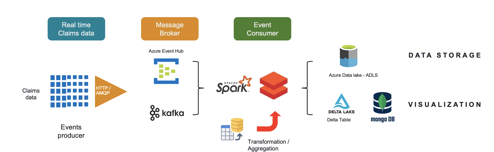
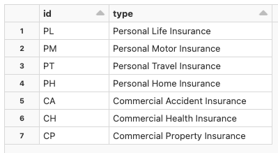

### End-to-end streaming pipeline using Azure event hub and Databricks Structured Streaming pyspark APIs ###

This is simple demo of end-to-end pipeline to process real time events being generated by local python utility. The publisher will push sample events to Azure event hub. These evenets then will be processed by Databricks notebook using pyspark Structured Streaming APIs.



The events are read by saprk readstream API and further processed to - 
- Archive to data lake (ADLS)
- Store the event to Delta lake for running analytical load
- Store the events incrementally to Mongo DB

#### Prerequisites ####
Following are the prerequisites for this project.
- Azure Subscription
- Python 3.+ installed on local machine

#### Setting up Azure resources ####
1. Using your Azure subscription, provision Event hub namespace. (e.g. `events-feed`)
2. Create Event hub with `demo-topic`
3. Create the new policy under 'Shared access policies' with 'Send' rights. Copy the connection string. Example:
```
 Endpoint=sb://events-feed.servicebus.windows.net/;SharedAccessKeyName=manage_user_access_policy;SharedAccessKey=EYMfb85RM5wMgBujKH+D+P/MbFb1Auo+BGkgAbWakIJ=;EntityPath=demo-topic
```
5. Provision Azure Databricks Service for consuming the events.
6. Provision Azure Data Lake ADLS Gen2 and copy the access key that you can use while mounting the ADLS in databricks notebook.
7. Provision MongoDB Atlas and copy the endpoint URL.

#### Setting up event publisher ####
The events are published by a small python utility that you can run locally on your machine.
##### Prerequisite ######
- Python 3.+ installed
- Install following python modules
	```
		$ pip install --upgrade pip
		$ pip install azure-eventhub
		$ pip install azure-eventhub-checkpointstoreblob-aio
		$ pip install confluent-kafka
		$ pip install faker
	```
- Copy `publisher` folder from this repository to your local folder.
- Set the connection string and event hub name in `main.py` file ( line 29, 30) based on your Azure setup

##### Running the event publisher ######
Now you can run any of the below mentioned command to generate the events
<b> OPTION -1 </b>
Run below command and you should be able to send events in multiple batches with each batch having 10 events bundled. (You can configure it as per your neeed)
```
$ python main.py
```
<b> OPTION -2 </b>
Run below command and you will be able to send the events as per the parameters passed.
```
python producer.py --namespace 'events-feed' --connection 'Endpoint=sb://events-feed.servicebus.windows.net/;SharedAccessKeyName=manage_user_access_policy;SharedAccessKey=vqiQd6gHWeGZdlY5cmV3kKyJmRssimyGM+yYiJTPonR=;EntityPath=demo-topic' --topic 'demo-topic' --messages '10' --sleeptime '10'
```
#### Setting up event consumer ####
##### Consuming the events using Structured streaming APIs #####
To consume these events, we will use Structured streaming dataframe APIs using pyspark. The Databricks notebooks can be copied from `consumer` folder to your workspace.

You can run the notebook and see the real time events being processed.

[IMPORTANT] To be able to run the notebooks, you need to create a dimension table in Databricks.
1. Create the database `events_db`
2. Create a table `insurance_types` with following data
